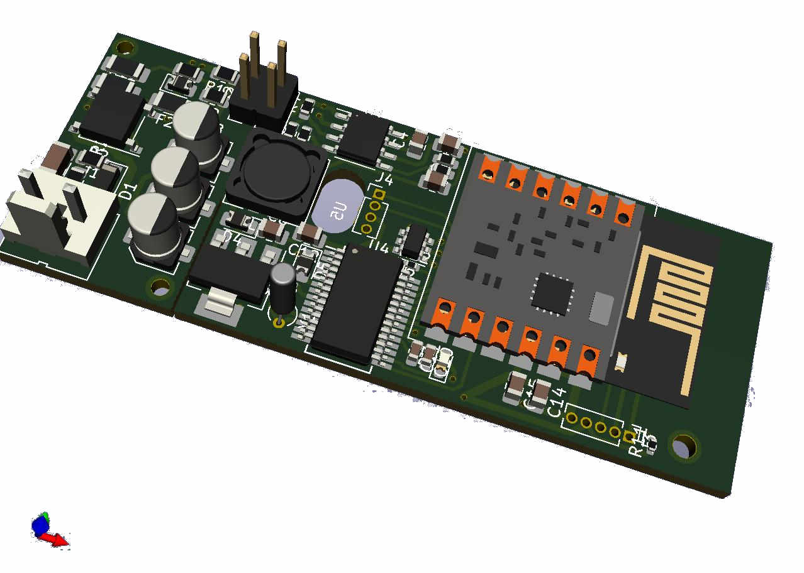

# Seminario de Soluciones Tecnologicas

## Descripción de la necesidad o idea

  Ante la necesidad de un cliente y una oportunidad de negocios en base a las necesidades de las empresas del sector de servicios públicos, se requiere una plataforma propietaria que brinde servicios de
  monitoréo en equipos electrónicos remotos para ambientes suburbanos, rural e industrias de espacios abiertos. 
  
  Como resultado de la finalidad del servicio de monitoreo, se entrega un pequeño dispositivo que comunica con otro dispositivo o sistema de aplicación específica del cliente.
  
  El dispositivo se denomina CbAMoT.
  
  
  
## Primeras pruebas:

Se implemento un equipamiento básico para realizar pruebas.
  
 
#### 3D view

## Vista con opciones de bateria y conector RF

## Video (YOUTUBE)
